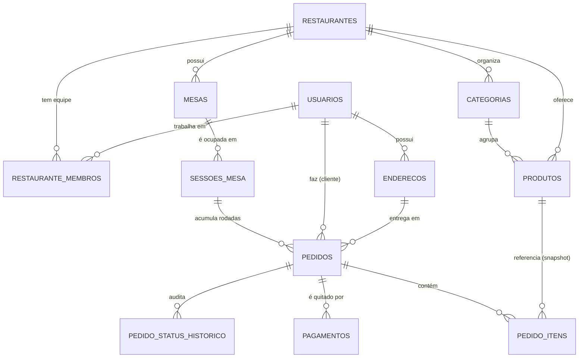
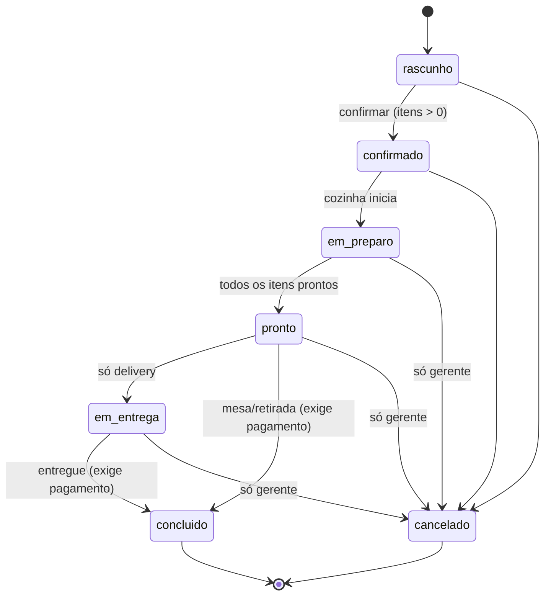
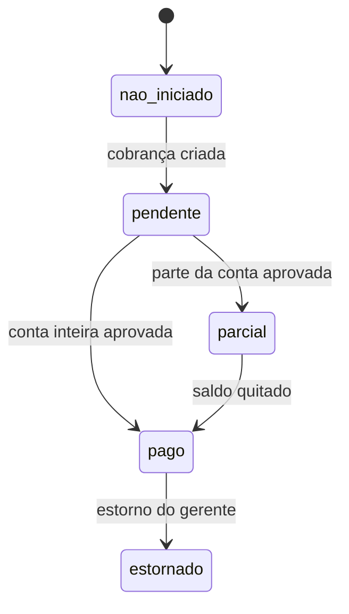
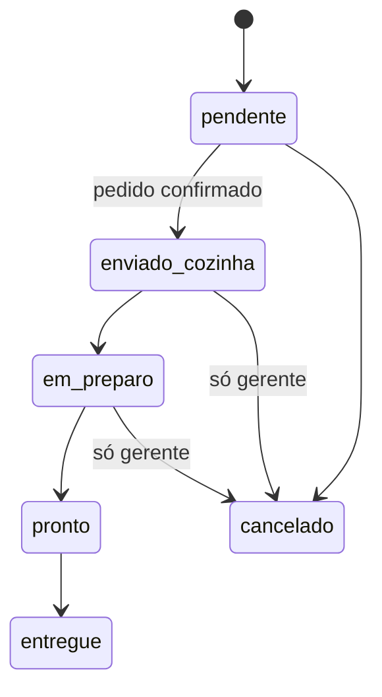
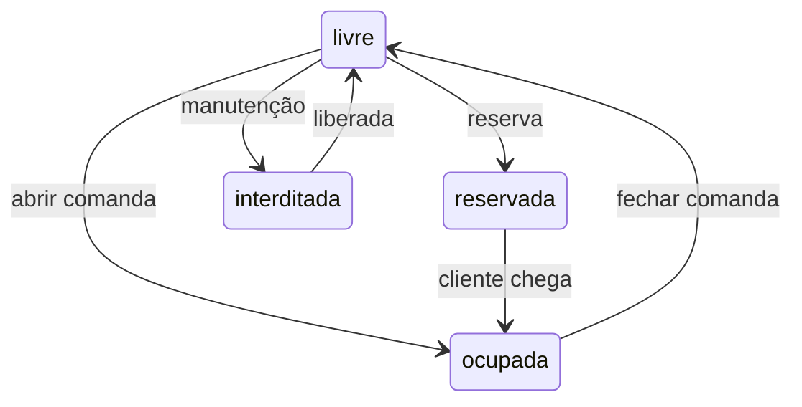

# SaborExpress — Documento de Regras de Negócio

**Versão:** 2.0 · **Data:** 17/08/2026 · **Autor:** Davi
**Sistema:** SaborExpress — gestão de restaurante multi-canal (salão, delivery e retirada)
**Stack:** Flutter (app) · Node.js + Express (API) · PostgreSQL (banco)

---

## Sumário

1. [Objetivo e escopo](#1-objetivo-e-escopo)
2. [Glossário](#2-glossário)
3. [Atores e perfis de acesso](#3-atores-e-perfis-de-acesso)
4. [Visão do domínio](#4-visão-do-domínio)
5. [Canais de venda](#5-canais-de-venda)
6. [Máquinas de estado](#6-máquinas-de-estado)
7. [Catálogo de regras de negócio](#7-catálogo-de-regras-de-negócio)
8. [Matriz de permissões](#8-matriz-de-permissões)
9. [Regras de cálculo com exemplos](#9-regras-de-cálculo-com-exemplos)
10. [Invariantes garantidas pelo banco](#10-invariantes-garantidas-pelo-banco)
11. [Casos de uso principais](#11-casos-de-uso-principais)
12. [Rastreabilidade: regra → código](#12-rastreabilidade-regra--código)

---

## 1. Objetivo e escopo

O SaborExpress é um sistema de gestão de restaurante que atende **três canais de venda** dentro de um modelo **multi-restaurante** (vários estabelecimentos na mesma plataforma, com dados isolados entre si):

| Canal | Quem inicia | Característica |
|---|---|---|
| **Mesa (salão)** | Garçom | Cliente sentado; comanda aberta; taxa de serviço de 10% |
| **Delivery** | Cliente pelo app | Endereço obrigatório; taxa de entrega; pedido mínimo |
| **Retirada** | Cliente pelo app | Sem taxa alguma; cliente busca no balcão |

**Está no escopo:** cadastro e autenticação, catálogo (cardápio), gestão de mesas e comandas, ciclo completo do pedido, fila da cozinha (KDS simplificado), pagamento com estados corretos (provedor simulado), relatórios gerenciais e auditoria de status.

**Não está no escopo desta versão:** emissão fiscal (NFC-e/SAT), integração real com adquirente ou Pix, roteirização de entregadores, controle de estoque de insumos, fidelidade/cupons (a estrutura de desconto existe, a regra de cupom não).

---

## 2. Glossário

| Termo | Definição |
|---|---|
| **Restaurante** | Estabelecimento (tenant). Todo dado operacional pertence a exatamente um restaurante. |
| **Usuário** | Pessoa cadastrada na plataforma. É global: o mesmo e-mail serve para pedir em qualquer restaurante. |
| **Membro** | Vínculo entre um usuário e um restaurante, com um perfil (gerente, garçom, cozinha, entregador). |
| **Cliente** | Usuário sem vínculo de equipe no restaurante em questão. |
| **Comanda (sessão de mesa)** | Período em que uma mesa está ocupada por um grupo. Pode conter vários pedidos (rodadas). |
| **Pedido** | Conjunto de itens com um destino (mesa, entrega ou balcão), um ciclo de produção e um ciclo financeiro. |
| **Item** | Linha do pedido. Guarda cópia congelada do nome e do preço do produto. |
| **Rodada** | Novo pedido lançado na mesma comanda ("mais uma cerveja"). |
| **Taxa de serviço** | Os 10% do garçom. Calculada sobre o subtotal, apenas em pedidos de mesa, e **facultativa**. |
| **Taxa de entrega** | Frete do delivery. Zerada quando o subtotal atinge o limite de frete grátis. |
| **Snapshot de preço** | Cópia do preço no momento em que o item entrou no pedido. Alterar o cardápio depois não muda pedidos antigos. |
| **Idempotência** | Repetir a mesma requisição de cobrança (mesma chave) não gera uma segunda cobrança. |

---

## 3. Atores e perfis de acesso

| Perfil | Escopo | O que faz |
|---|---|---|
| **Cliente** | Plataforma | Navega no cardápio, monta pedido de delivery/retirada, paga, acompanha status, gerencia seus endereços. |
| **Garçom** | Um restaurante | Abre/fecha comanda, lança pedidos de mesa, adiciona rodadas, registra pagamento presencial, movimenta status. |
| **Cozinha** | Um restaurante | Vê a fila de produção, marca itens em preparo/prontos, sinaliza produto indisponível. |
| **Entregador** | Um restaurante | Recebe pedido pronto, coloca em rota, confirma entrega e pagamento na entrega. |
| **Gerente** | Um restaurante | Tudo do restaurante: cardápio, mesas, equipe, cancelamentos excepcionais, estornos, relatórios. |

> **Princípio:** o perfil não vive dentro do token de autenticação. Ele é consultado no banco a cada requisição, para que desligar um funcionário tenha efeito imediato — sem esperar o token expirar (RN-SEG-003).

---

## 4. Visão do domínio



**Dicionário de dados — tabelas principais**

| Tabela | Papel | Colunas-chave |
|---|---|---|
| `restaurantes` | Tenant + parâmetros comerciais | `taxa_servico_percentual`, `taxa_entrega_padrao`, `pedido_minimo_delivery`, `frete_gratis_acima_de`, `aberto` |
| `usuarios` | Identidade global | `email` (único, case-insensitive), `senha_hash` (bcrypt) |
| `restaurante_membros` | Vínculo + perfil | `(restaurante_id, usuario_id)` único |
| `categorias` / `produtos` | Cardápio | `ativo` (existe?) vs `disponivel` (tem hoje?) |
| `mesas` | Layout do salão | `numero` único por restaurante; `status` derivado da comanda |
| `sessoes_mesa` | Comanda | `status`, `servico_aceito`, `aberta_em`/`fechada_em` |
| `pedidos` | Venda | `status` (produção) + `status_pagamento` (financeiro), `codigo` diário |
| `pedido_itens` | Linha da venda | `produto_nome` e `preco_unitario` congelados; `status` para a cozinha |
| `pagamentos` | Recebimento | `metodo`, `status`, `valor`, `idempotency_key` |
| `pedido_status_historico` | Auditoria | preenchido por *trigger*, não pelo código |

---

## 5. Canais de venda

### 5.1 Mesa (salão)

```
Garçom abre comanda → lança pedido (rodada 1) → cozinha produz → serve
      → cliente pede mais (rodada 2) → ... → fechar conta → pagar → fechar comanda
```

- A **comanda** é o guarda-chuva. Cada rodada é um pedido novo, com seu próprio ciclo de produção.
- A conta da mesa é a **soma dos pedidos não cancelados** da comanda.
- A mesa só volta a ficar "livre" quando a comanda é fechada, e a comanda só fecha com tudo pago e nada em produção.

### 5.2 Delivery

```
Cliente monta carrinho → escolhe endereço → confirma (valida pedido mínimo e calcula frete)
      → paga (ou escolhe pagar na entrega) → cozinha → pronto → em rota → entregue
```

### 5.3 Retirada

```
Cliente monta carrinho → confirma (sem frete, sem serviço) → paga → cozinha → pronto
      → cliente retira no balcão → concluído
```

---

## 6. Máquinas de estado

### 6.1 Pedido — ciclo de **produção**



`concluido` e `cancelado` são **estados finais**: uma vez lá, o pedido não muda mais.

### 6.2 Pedido — ciclo **financeiro** (independente da produção)



O valor de `status_pagamento` **não é digitado por ninguém**: é sempre derivado da soma dos pagamentos aprovados versus o total do pedido.

### 6.3 Item — fila da cozinha (KDS)



### 6.4 Mesa e comanda



O status da mesa é **consequência** da comanda, mantido em sincronia por *trigger* no banco. Ninguém edita `mesas.status` diretamente no fluxo normal.

---

## 7. Catálogo de regras de negócio

### 7.1 Usuários e acesso (USR)

| ID | Regra |
|---|---|
| **RN-USR-001** | O cadastro público cria **sempre** um cliente. Perfis de equipe só existem por cadastro feito por um gerente do restaurante. |
| **RN-USR-002** | O e-mail é único em toda a plataforma, ignorando maiúsculas/minúsculas (`joao@X.com` = `JOAO@x.com`). |
| **RN-USR-003** | O cliente é global: a mesma conta pede em qualquer restaurante. O funcionário é local: precisa de vínculo com o restaurante. |
| **RN-USR-004** | Senha: mínimo de 8 caracteres, com ao menos uma letra e um número. Armazenada apenas como hash bcrypt (custo 10). |
| **RN-USR-005** | Cada usuário tem no máximo um endereço marcado como principal. |
| **RN-USR-006** | Ao cadastrar um funcionário cujo e-mail já existe na plataforma, o usuário é reaproveitado e apenas o vínculo é criado — nunca se duplica cadastro. |
| **RN-USR-007** | Desligar um funcionário desativa o vínculo, não o usuário: ele continua podendo usar o app como cliente. |

### 7.2 Catálogo (CAT)

| ID | Regra |
|---|---|
| **RN-CAT-001** | Categoria e produto pertencem a um único restaurante. Nome de produto é único dentro do restaurante. |
| **RN-CAT-002** | Preço deve ser maior que zero. |
| **RN-CAT-003** | `ativo` significa "existe no cardápio"; `disponivel` significa "tem hoje". O cardápio público mostra só o que é ativo **e** disponível; a equipe enxerga os dois estados. |
| **RN-CAT-004** | Produto nunca é apagado fisicamente — é desativado. Apagar destruiria o histórico de pedidos. |
| **RN-CAT-005** | Garçom e cozinha podem marcar um produto como indisponível ("acabou"), mas só o gerente altera preço, nome ou categoria. |
| **RN-CAT-006** | Alterar o preço de um produto **não** altera o valor de pedidos já lançados (ver RN-PED-006). |

### 7.3 Mesas e comandas (MESA)

| ID | Regra |
|---|---|
| **RN-MESA-001** | Abrir comanda equivale a ocupar a mesa; fechar comanda equivale a liberá-la. |
| **RN-MESA-002** | Uma mesa não pode ter duas comandas abertas ao mesmo tempo (garantido por índice único parcial no banco, não só pelo código). |
| **RN-MESA-003** | Mesa interditada não recebe comanda. |
| **RN-MESA-004** | A comanda só fecha quando **todos** os pedidos dela estiverem pagos e **nenhum** estiver em produção. |
| **RN-MESA-005** | A quantidade de pessoas não pode exceder a capacidade cadastrada da mesa. |
| **RN-MESA-006** | Fechar a comanda registra quem fechou e o horário — base do relatório de tempo médio de ocupação. |

### 7.4 Pedido (PED)

| ID | Regra |
|---|---|
| **RN-PED-001** | Todo pedido recebe um código legível `AAAAMMDD-NNNN`, com numeração reiniciada por dia e por restaurante. |
| **RN-PED-002** | Coerência de tipo: `mesa` exige comanda aberta e proíbe endereço; `delivery` exige endereço e proíbe comanda; `retirada` não aceita nenhum dos dois e tem taxas zeradas. |
| **RN-PED-003** | O endereço só é obrigatório a partir da confirmação — o cliente pode montar o carrinho antes de escolher onde receber. |
| **RN-PED-004** | Não se abre pedido com o restaurante fechado ou em um canal que ele não aceita. |
| **RN-PED-005** | Itens entram enquanto o pedido está em rascunho. Em pedidos de mesa, também é permitido incluir itens com o pedido `confirmado`/`em_preparo` (rodada extra) — nunca depois de pago. |
| **RN-PED-006** | O item guarda **cópia** do nome e do preço do produto no momento da inclusão. O histórico é imutável. |
| **RN-PED-007** | Item que já está pronto ou entregue não pode ter a quantidade alterada. |
| **RN-PED-008** | Só pedido de delivery passa pelo estado `em_entrega`. |
| **RN-PED-009** | Cancelar item que já foi para a cozinha exige perfil de gerente e motivo registrado — o consumo não "some" da conta sem rastro. |
| **RN-PED-010** | Pedido não é concluído sem o pagamento confirmado. |
| **RN-PED-011** | O cliente cancela sozinho apenas enquanto o pedido está em `rascunho` ou `confirmado`. Depois que entra em produção, só o restaurante cancela. |
| **RN-PED-012** | Pedido sem nenhum item válido não pode ser confirmado. |
| **RN-PED-013** | Pedido já pago só é cancelado após o estorno do pagamento. |
| **RN-PED-014** | Concluir o pedido marca todos os itens como entregues; cancelar o pedido cancela os itens junto, com motivo. |
| **RN-PED-015** | Toda mudança de status é registrada em histórico com autor e horário (auditoria automática por *trigger*). |

### 7.5 Cálculo de valores (CAL)

| ID | Regra |
|---|---|
| **RN-CAL-001** | `subtotal` = soma de (quantidade × preço unitário) dos itens **não cancelados**. |
| **RN-CAL-002** | Delivery só é confirmado se o subtotal atingir o pedido mínimo do restaurante. |
| **RN-CAL-003** | `taxa_entrega` = 0 quando o subtotal atinge o limite de frete grátis; caso contrário, a taxa padrão do restaurante. Fixada no momento da confirmação. |
| **RN-CAL-004** | Taxa de serviço só existe em pedidos de mesa. Delivery e retirada têm `taxa_servico = 0`. |
| **RN-CAL-005** | A taxa de serviço é **facultativa**: recusada pelo cliente, sai imediatamente de todos os pedidos ainda não pagos daquela comanda. |
| **RN-CAL-006** | `desconto` nunca é maior que o subtotal. |
| **RN-CAL-007** | `total` = `subtotal` − `desconto` + `taxa_entrega` + `taxa_servico`. Essa igualdade é uma *check constraint*: é impossível gravar um total inconsistente. |
| **RN-CAL-008** | Todo dinheiro é `numeric(10,2)` e todo cálculo acontece no banco. A aplicação nunca soma valores em ponto flutuante. |
| **RN-CAL-009** | Qualquer alteração em itens dispara o recálculo do pedido dentro da mesma transação. |

### 7.6 Pagamento (PAG)

| ID | Regra |
|---|---|
| **RN-PAG-001** | Não se cobra pedido em rascunho — o valor ainda pode mudar. |
| **RN-PAG-002** | A soma dos pagamentos aprovados + pendentes nunca ultrapassa o total do pedido. |
| **RN-PAG-003** | Um pedido aceita **vários** pagamentos (conta dividida). Sem informar valor, cobra-se exatamente o saldo restante. |
| **RN-PAG-004** | Pagamento em dinheiro, na entrega ou no local é confirmado pela equipe, nunca pelo próprio cliente. |
| **RN-PAG-005** | Estorno é privativo do gerente e exige motivo registrado. |
| **RN-PAG-006** | Cobranças aceitam chave de idempotência: repetir a requisição devolve o mesmo pagamento em vez de cobrar duas vezes. |
| **RN-PAG-007** | `status_pagamento` do pedido é sempre derivado: `pago` (aprovado ≥ total), `parcial` (0 < aprovado < total), `pendente`, `estornado` ou `nao_iniciado`. |
| **RN-PAG-008** | Dados de cartão **não são armazenados** em nenhum momento. O sistema guarda apenas método, valor, status, provedor e o identificador devolvido pelo provedor. |
| **RN-PAG-009** | Troco informado não pode ser menor que o valor a pagar. |

### 7.7 Cozinha (KDS)

| ID | Regra |
|---|---|
| **RN-KDS-001** | Confirmar o pedido envia todos os itens pendentes para a fila da cozinha. |
| **RN-KDS-002** | Quando o primeiro item entra em preparo, o pedido passa a `em_preparo`; quando o último fica pronto, o pedido passa a `pronto` automaticamente. |
| **RN-KDS-003** | A fila é ordenada por antiguidade e exibe o tempo de espera em minutos. |
| **RN-KDS-004** | Itens de pedidos cancelados ou concluídos não aparecem na fila. |

### 7.8 Relatórios (REL)

| ID | Regra |
|---|---|
| **RN-REL-001** | Faturamento considera **apenas** pedidos concluídos. Pedido em produção ou cancelado não entra. |
| **RN-REL-002** | A taxa de serviço é exibida em separado do faturamento: ela é repasse à equipe, não receita do restaurante. |
| **RN-REL-003** | Ranking de produtos ignora itens cancelados. |
| **RN-REL-004** | Todo relatório é obrigatoriamente filtrado pelo restaurante do gerente autenticado. |

### 7.9 Segurança (SEG)

| ID | Regra |
|---|---|
| **RN-SEG-001** | A resposta de login é idêntica para "e-mail inexistente" e "senha errada" — não se revela quais e-mails estão cadastrados. |
| **RN-SEG-002** | Toda operação sob um restaurante verifica vínculo ativo **e** perfil compatível. |
| **RN-SEG-003** | O token carrega apenas o id do usuário; perfil e vínculo são lidos do banco a cada requisição. |
| **RN-SEG-004** | Um pedido de um restaurante não pode conter produto de outro — garantido por chave estrangeira composta `(restaurante_id, produto_id)`. |
| **RN-SEG-005** | O login é limitado a 10 tentativas por IP a cada 15 minutos. |
| **RN-SEG-006** | O cliente só enxerga os próprios pedidos. |
| **RN-SEG-007** | Em produção, o CORS aceita apenas as origens declaradas em configuração. |
| **RN-SEG-008** | Nenhuma resposta da API inclui `senha_hash`. |

---

## 8. Matriz de permissões

| Operação | Cliente | Garçom | Cozinha | Entregador | Gerente |
|---|:--:|:--:|:--:|:--:|:--:|
| Ver cardápio | ✔ | ✔ | ✔ | ✔ | ✔ |
| Criar/editar produto | — | — | — | — | ✔ |
| Marcar produto indisponível | — | ✔ | ✔ | — | ✔ |
| Abrir/fechar comanda | — | ✔ | — | — | ✔ |
| Criar pedido de mesa | — | ✔ | — | — | ✔ |
| Criar pedido delivery/retirada | ✔ | ✔ | — | — | ✔ |
| Adicionar item ao próprio pedido | ✔ | ✔ | — | — | ✔ |
| Cancelar item ainda não enviado | ✔ | ✔ | — | — | ✔ |
| Cancelar item já na cozinha | — | — | — | — | ✔ |
| Confirmar pedido | ✔ | ✔ | — | — | ✔ |
| Mover para em preparo / pronto | — | ✔ | ✔ | — | ✔ |
| Mover para em entrega / concluído | — | ✔ | — | ✔ | ✔ |
| Cancelar antes da produção | ✔ | ✔ | — | — | ✔ |
| Cancelar depois da produção | — | — | — | — | ✔ |
| Criar cobrança | ✔ | ✔ | — | ✔ | ✔ |
| Confirmar pagamento em dinheiro | — | ✔ | — | ✔ | ✔ |
| Estornar pagamento | — | — | — | — | ✔ |
| Gerenciar equipe | — | — | — | — | ✔ |
| Ver relatórios | — | — | — | — | ✔ |

---

## 9. Regras de cálculo com exemplos

### Exemplo 1 — Mesa com taxa de serviço

| Item | Qtd | Unitário | Total |
|---|--:|--:|--:|
| Pizza de Bacon | 1 | 45,00 | 45,00 |
| Coca-Cola lata | 2 | 6,00 | 12,00 |
| **Subtotal** | | | **57,00** |
| Taxa de serviço (10%) | | | 5,70 |
| **Total** | | | **62,70** |

Se o cliente recusar o serviço (RN-CAL-005), o total volta para **R$ 57,00** imediatamente.

### Exemplo 2 — Delivery abaixo do frete grátis

Subtotal R$ 48,00 · pedido mínimo R$ 25,00 ✔ · frete grátis a partir de R$ 120,00 ✘
→ taxa de entrega R$ 10,00 · taxa de serviço R$ 0,00 → **total R$ 58,00**

### Exemplo 3 — Delivery com frete grátis

Subtotal R$ 135,00 ≥ R$ 120,00 → taxa de entrega **R$ 0,00** → total R$ 135,00

### Exemplo 4 — Delivery recusado

Subtotal R$ 6,00 < pedido mínimo R$ 25,00 → confirmação bloqueada com o código `PEDIDO_MINIMO`.

### Exemplo 5 — Conta dividida

Total R$ 62,70 · pagamento 1 em dinheiro R$ 30,00 (aprovado) → `status_pagamento = parcial`
Pagamento 2 em Pix sem valor informado → cobra o saldo, R$ 32,70 → aprovado → `status_pagamento = pago`
Tentar um terceiro pagamento de R$ 100,00 → bloqueado com `VALOR_EXCEDE_TOTAL`.

### Exemplo 6 — Retirada

Subtotal R$ 24,00 · taxa de entrega R$ 0,00 · taxa de serviço R$ 0,00 → **total R$ 24,00**

---

## 10. Invariantes garantidas pelo banco

Regra que existe só no código pode ser furada por um script, por outro serviço ou por um bug. Estas ficam no PostgreSQL:

| Invariante | Mecanismo |
|---|---|
| `total = subtotal − desconto + taxa_entrega + taxa_servico` | *check constraint* `chk_total_consistente` |
| Coerência entre tipo do pedido e seus vínculos | *checks* `chk_pedido_mesa`, `chk_pedido_delivery`, `chk_pedido_retirada` |
| Uma comanda aberta por mesa | índice único parcial `uq_sessao_aberta_por_mesa` |
| Produto do pedido é do mesmo restaurante | FK composta `fk_item_produto (restaurante_id, produto_id)` |
| Categoria do produto é do mesmo restaurante | FK composta `fk_produto_categoria` |
| E-mail único ignorando caixa | índice único `uq_usuarios_email_lower` |
| Um endereço principal por usuário | índice único parcial `uq_endereco_principal` |
| Quantidade > 0 e preço ≥ 0 | *checks* em `pedido_itens` e `produtos` |
| Cancelamento sem motivo | *checks* `chk_cancelamento` e `chk_item_cancelado` |
| Cobrança duplicada | único `uq_pagamento_idempotency` |
| Histórico de status | *trigger* `trg_pedido_historico` |
| Status da mesa em sincronia com a comanda | *trigger* `trg_sessao_sincroniza_mesa` |
| Numeração diária do pedido | *trigger* `trg_pedido_codigo` + tabela `pedido_contadores` |

---

## 11. Casos de uso principais

### CU-01 — Atendimento no salão (garçom)

1. Garçom faz login e abre a lista de mesas.
2. Toca na Mesa 01 (livre) e abre a comanda informando 3 pessoas → mesa fica **ocupada**.
3. Cria o pedido da comanda e lança 1 Pizza de Bacon e 2 Coca-Colas.
4. Sistema calcula: subtotal 57,00 + serviço 5,70 = **62,70**.
5. Garçom confirma o pedido → itens vão para a fila da cozinha.
6. Cozinha marca em preparo e depois pronto → pedido vira **pronto** sozinho.
7. Cliente pede a conta: garçom registra R$ 30,00 em dinheiro e R$ 32,70 em Pix.
8. Com tudo aprovado, o pedido é concluído e a comanda fechada → mesa volta a **livre**.

**Exceções:** tentar abrir uma segunda comanda na mesma mesa → `409`; fechar a comanda com pedido em produção → `PEDIDO_EM_PRODUCAO`; concluir sem pagamento → `PAGAMENTO_PENDENTE`.

### CU-02 — Pedido de delivery (cliente)

1. Cliente entra no app, escolhe o restaurante e monta o carrinho.
2. Seleciona o endereço principal.
3. Confirma → sistema valida o pedido mínimo e calcula a taxa de entrega.
4. Escolhe Pix (cobrança criada com QR Code) ou "pagar na entrega".
5. Acompanha: confirmado → em preparo → pronto → em rota → entregue.

**Exceções:** subtotal abaixo do mínimo → `PEDIDO_MINIMO`; tentar cancelar depois do preparo → `CANCELAMENTO_TARDIO`; tentar aprovar sozinho o pagamento na entrega → `403`.

### CU-03 — Gestão de cardápio (gerente)

1. Gerente cadastra "Pizza Portuguesa" por R$ 49,90 → aparece no cardápio público.
2. Faltou ingrediente: o garçom marca o produto como indisponível → some do cardápio do cliente, permanece visível para a equipe.
3. Produto que sai de linha é desativado, nunca apagado — os pedidos antigos continuam mostrando o nome e o preço da época.

### CU-04 — Fechamento do dia (gerente)

1. Abre os relatórios do período.
2. Vê pedidos concluídos, faturamento, ticket médio e a divisão por canal.
3. Confere a taxa de serviço acumulada (valor a repassar à equipe).
4. Consulta o ranking de produtos e a ocupação média das mesas.

---

## 12. Rastreabilidade: regra → código

| Grupo de regras | Onde está implementado |
|---|---|
| USR, SEG (autenticação) | `src/modules/auth/auth.service.js`, `src/middlewares/autenticar.js`, `src/utils/senha.js` |
| SEG (perfil e tenant) | `src/middlewares/restaurante.js` |
| CAT | `src/modules/catalogo/catalogo.service.js` |
| MESA | `src/modules/mesas/mesas.service.js` |
| PED (transições) | `src/modules/pedidos/pedidos.maquinaDeEstados.js` |
| PED (itens e confirmação) | `src/modules/pedidos/pedidos.service.js` |
| CAL | função `recalcular_pedido()` em `database/migrations/001_schema.sql` + `pedidos.service.js` |
| PAG | `src/modules/pagamentos/pagamentos.service.js` |
| KDS | `pedidos.service.js` (`filaCozinha`, `alterarStatusItem`) |
| REL | `src/modules/relatorios/relatorios.routes.js` |
| Invariantes | `database/migrations/001_schema.sql` |

**Verificação automatizada:** `tests/e2e.test.js` cobre 29 cenários, entre caminhos felizes e regras que precisam **barrar** operações inválidas (transição inválida, cancelamento tardio, pedido mínimo, valor excedente, isolamento entre restaurantes, produto de outro restaurante, cliente acessando pedido alheio). Executar com `npm test`.
